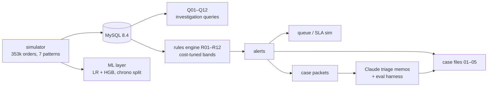

# bnpl-fraud-workbench

An end-to-end buy-now-pay-later fraud operation in miniature: a deterministic BNPL
transaction simulator with labeled fraud patterns injected into realistic benign
traffic; a MySQL investigation layer with a twelve-query analyst library; an
interpretable rules engine tuned against explicit loss/review/insult costs; an alert
queue with SLA simulation; a chronologically validated ML detection layer with
per-pattern error analysis; and a Claude-powered investigation-memo drafter with a
measured evaluation harness (action accuracy, policy-citation validity, consistency,
latency, and concrete-token grounding). Five written case investigations show the
analyst workflow end to end.

**All data is synthetic and labeled.** Fraud patterns are injected by
[`simulator/patterns.py`](simulator/patterns.py) — every performance number below is a
statement about method on simulated data, not a real-world rate claim. See
[Limitations](#limitations--honesty).



## Headline results (regenerate with `make demo`)

<!-- results:start -->
| layer | result (configured holdout starts 2026-04-01 unless noted) |
|---|---|
| simulator | 352,984 orders / 41,410 users / 12 × 30-day months (360 days); fraud base rate 0.94% of approved orders; generation ~2 min on a laptop, deterministic (seed 416) |
| rules @ tuned bands (30/90) | 24.9 alerts/day · precision 8.9% · recall 59.8% · $37,847 fraud caught · 0 false auto-declines · net +$32,550 under the cost model |
| ML (HistGradientBoosting) | PR-AUC 0.95 vs logistic 0.73 · precision@capacity 9.0% · never-pay 100%: caught by the model, missed by transaction-time rules — see CASE-04 |
| queue sim | 2 analysts, offset 7-day-coverage shifts · SLA(≤4 business h) 99.9% · score-priority blocks $31,350 pre-fulfillment vs $30,246 FIFO |
| triage (claude-sonnet-5, prompt v2) | action accuracy 73.5% · decline precision 96.8% / recall 52.6% · non-verbatim concrete-token fields in 13.0% of memos; unsupported after derived-list classification 4.5% · consistency 84% (N=200) |
| prompt iteration v1→v2 (same model/cases) | non-verbatim concrete-token fields 45%→13%; unsupported after derived-list classification 33.5%→4.5% · action accuracy +12.5% |
| cross-model arms | gpt-5.6-terra 76.7% accuracy / 70% decline recall (N=86, quota-cut) · gpt-5.6-luna 59.8% valid-output accuracy (N=199; 59.5% with its schema failure counted wrong) |
<!-- results:end -->

## Quickstart

```bash
docker compose up -d        # MySQL 8.4; first run may pull the image
make venv                   # python 3.11+; resolves Python packages
make demo                   # generate → load → rules → model → queue → llm-eval (offline)
```

The LLM replay needs **no API keys and is fully offline**: eval-set responses are
committed to [`llm/eval/cache/`](llm/eval/cache), and the harness uses `--offline`.
Initial setup is not network-free: `make venv` resolves packages, and the first compose
run may pull `mysql:8.4`. Live modes: any Claude Code-compatible CLI
(`CLAUDE_CLI_BIN`) or the `anthropic` SDK (`ANTHROPIC_API_KEY`, `LLM_BACKEND=api`).

## The layers

**Simulator** ([`simulator/`](simulator)) — pay-in-4 mechanics (25% down + 3 biweekly
installments; the platform pays the merchant up front, so loss = principal − collected).
Benign traffic is deliberately rich: repeat customers, seasonality, travelers, movers,
gift buyers, device churn, and ~2.5% *benign hardship defaulters* — the mimics that make
detection non-trivial (FP-1 §6). Seven injected patterns: account takeover, stolen-card
(with card-testing preludes), synthetic rings (warm-up → bust-out), first-party
never-pay, INR/friendly-fraud abuse, promo farming, merchant bust-out. Ground truth
lives in a separate `labels` table that analyst-facing layers never read — enforced by
tests and a packet-builder assertion.

**Investigation library** ([`db/queries/`](db/queries)) — twelve MySQL-8 queries, each
headed by the investigative question it answers: velocity, shared-attribute linkage,
new-account risk, repayment cohorts, the ATO event chain, merchant health, promo
clusters, card testing, dispute abuse, geo-velocity (with an embedded centroid CTE),
queue ops, and loss accounting.

**Policy + rules** ([`policy/fraud-policy.md`](policy/fraud-policy.md),
[`rules/`](rules)) — FP-1 is a written internal policy: definitions (fraud vs credit vs
abuse), evidence standards, an action ladder, per-rule intent, and false-positive
guidance. R01–R12 implement it with per-order rationale strings, so every alert is
explainable. [`rules/tuning.py`](rules/tuning.py) sweeps the review/decline bands —
**selected before the configured 2026-04-01 holdout, reported after it** — under an explicit cost model
(review $2.50/case; false decline = 5% margin + $15 LTV proxy; both are stated
assumptions). Output: [`reports/tradeoffs.md`](reports/tradeoffs.md) + frontier SVG.

**Queue / SLA simulation** ([`queue_sim/`](queue_sim)) — discrete-event sim of two
analysts on offset shifts with a 12-hour fulfillment race: an alert resolved after the
order ships doesn't save the money. Compares FIFO vs rule-score vs LLM-priority
dispatch on SLA attainment, time-to-decision, and **fraud-$ blocked before
fulfillment** ([`reports/queue.md`](reports/queue.md)).

**ML layer** ([`model/`](model)) — point-in-time features with a **leakage-guard test**
(25 random orders recomputed on time-truncated data must reproduce identical rows),
chronological train/holdout split (no shuffling: fraud drifts, and random splits leak
ring structure), logistic regression + HistGradientBoosting, PR-AUC (not ROC at a ~1%
base rate), precision@review-capacity, calibration, recall-by-pattern, and a
rules-vs-model-vs-hybrid fraud-dollar comparison at review capacity
([`reports/model.md`](reports/model.md)).

**Claude triage** ([`llm/`](llm)) — the packet builder assembles everything an analyst
would pull (profile, history, fired rules with rationales, linkage counts, repayment)
and excludes ground truth through a label-key walk in tests. The memo drafter
returns structured JSON: signals (verbatim facts), competing hypotheses *including the
benign one*, policy citations, action, priority, evidence gaps. Human-in-the-loop by
design: the model drafts and prioritizes; the analyst owns decisions (FP-1 §7) — CASE-05
shows an analyst override in action.

**The eval harness** ([`llm/eval/`](llm/eval)) uses 200 frozen stratified cases (all 7
patterns + 60 hard negatives), token-boundary checks over concrete tokens in
`signals_observed`, citation-validity checks, perturbation-consistency, and latency.
The token check classifies verbatim, derived-list, and unsupported fields; it does not
verify semantic truth. The evaluation harness and iteration log document how the LLM
layer was measured ([`llm/eval/ITERATION.md`](llm/eval/ITERATION.md)); every prompt
change carries its before/after metric table. Model routing is
config-driven per task ([`config.yaml`](config.yaml) `llm.tasks`) with env/CLI
overrides.

**Uncertainty and stress** ([`analysis/uncertainty.py`](analysis/uncertainty.py),
[`queue_sim/sweep.py`](queue_sim/sweep.py)) — every published rate carries a Wilson 95%
interval beside its raw numerator and denominator, the v1→v2 prompt change is tested on
its discordant pairs rather than as a bare difference, holdout PR-AUC carries a bootstrap
band, and the rules operating point is shown moving across the tuning grid
([`reports/uncertainty.md`](reports/uncertainty.md)). The queue is swept over arrival
multipliers ×1–×8 and rosters of one to four analysts, so the SLA target and the
fraud-dollar curve have break points instead of one comfortable number
([`reports/queue_frontier.md`](reports/queue_frontier.md)).

**Vendor enrichment** ([`vendor/`](vendor)) — optional IPQualityScore email/IP scoring
feeding rule R12: `make vendor` (synthetic stand-in scores, clearly labeled) or
`make vendor-live` with `IPQS_API_KEY`. Kept out of `make demo` so the headline numbers
above stay exactly reproducible from the seed; the run reported here executed without
vendor signals.

## Case files — the analyst workflow, end to end

| case | one line |
|---|---|
| [CASE-01](cases/CASE-01-account-takeover.md) | Tenured account, credential chain → $3.6k jewelry burst; the R01 signature vs the new-phone mimic; measured follow-up: +12 ATO auto-declines at zero insult cost |
| [CASE-02](cases/CASE-02-card-testing-stolen-card.md) | Five $25–$38 probes at 4-minute cadence → $1,940 of approvals; proposed device cooldown hits 46 fraud devices, 0 benign |
| [CASE-03](cases/CASE-03-synthetic-ring-bustout.md) | 80 mailinator accounts, 26 devices, 2 drop addresses; $9.8k of perfectly repaid warm-up buys $68.7k of burst; includes a measured *rejected* proposal |
| [CASE-04](cases/CASE-04-neverpay-vs-hardship.md) | Two written-off accounts, opposite verdicts — the credit-vs-fraud line, and why never-pay isn't a transaction-time detection problem |
| [CASE-05](cases/CASE-05-traveler-cleared.md) | The false positive, cleared: 105/105 installments paid, a laptop in Hanoi, and a proposed R03 suppression measured at 4.3 benign alerts/day |

## Repository practices

The simulator uses a single seeded RNG; two runs are byte-identical in tests.
Ruff-clean, 124 tests (13 require MySQL). CI installs and lints, generates and loads a 5%
world, runs rules/tuning, model train/evaluate, queue simulation and staffing sweep, and
the uncertainty pass, then restores the full-scale CSVs for the tests, case selection, and
the offline LLM replay. Runtime
evaluation uses no API keys; dependency installation and image checkout require network.

## Limitations & honesty

- **Synthetic data.** Injected patterns are scripted adversaries; real fraud adapts,
  drifts, and correlates with things no simulator captures. Numbers here demonstrate
  that the *measurement machinery* works, not that these rates transfer.
- Benign/fraud separability is partly structural. `ship_addr_is_new` is true for 45.5%
  of fraud orders versus 0.1% of benign orders because benign addresses carry
  `added_ts = signup_ts` and benign signups skew old; `account_age_days` carries the
  same structure. The tuned rules' 0 false auto-declines follows from this population,
  not evidence that production insults would be zero.
- The benign R03 geo-mismatch base rate is inflated by a simulator inconsistency:
  home-IP country is independent of KYC country for about 25% of users. Workload and
  CASE-05 suppression counts measure this simulated population; the planned simulator
  correction will change them.
- P-SYNTH and P-MERCH have zero holdout orders because their scheduled episodes end
  before month 10. Every holdout model/rules metric therefore covers five of seven
  injected patterns.
- Never-pay ground truth includes a 30% benign-looking branch—150 accounts—that pays one
  installment. This is stricter than the written policy's zero-intent definition.
- Cost parameters ($2.50 review, 5%+$15 insult) are assumptions, stated and centralized
  in config; the tuning frontier is conditional on them.
- Chargeback timing, issuer behavior, and label latency are simplified; production
  systems fight feedback loops and delayed ground truth this repo doesn't model.
- The LLM eval measures grounding and decision quality *against this policy on these
  packets*; it is a methodology demonstration, not a claim that memo drafting is
  solved.

## License

MIT · Author: Alejandro Guerrero Padrés
