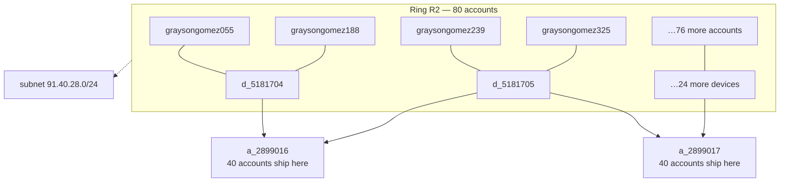

# CASE-03 — Synthetic account ring: warm-up, then coordinated bust-out

**Alerts:** 280+ alerts across the burst window; exemplar #2467 (order 351786, score
130, band decline: R02+R05+R06+R08) · **Cluster:** 80 accounts, 26 shared devices,
2 shared ship addresses, one normalized email root · **Window:** accounts created 2025-08-16 →
2025-09-16; burst 2025-10-19 01:31 → 10-21 12:48 · **Exposure:** $68,653 ordered in 60
hours · **Resolution:** ring confirmed → `escalate`, all member accounts blocked ·
**Pattern (ground truth, post-hoc):** P-SYNTH (ring R2)

## Alert context

Exemplar alert #2467 stacked four linkage rules: 3 accounts on the device (R02),
device-level velocity (R05), disposable email domain (R06), and — the loudest — **28
distinct accounts shipping to the same address** (R08). Auto-decline band. Q02 had been
surfacing the cluster for weeks before the burst; the burst turned a watchlist into an
incident.

## Evidence

Linkage (Q02 on the cluster):

| link | value | accounts |
|---|---|---|
| ship address | a_2899016 | **40** (146 orders) |
| ship address | a_2899017 | **40** (146 orders) |
| device (top) | d_5181704 | 4 |
| devices (26 total) | d_5181704…d_5181729 | 3–4 accounts each |
| normalized email root | `graysongomez@mailinator.com` | **80** after Q02 strips trailing digit runs (e.g. graysongomez055, -188, -239, -325, -452) |
| IP subnet | 91.40.28.0/24 | all 80 accounts |

Two-phase behavior (the economics of a bust-out):

| phase | orders | avg ticket | total | installments paid |
|---|---|---|---|---|
| warm-up (Aug 16 – Oct 2) | 175 | $56.01 | $9,802 | **525/525 (100%)** |
| burst (Oct 19 – Oct 21) | 111 | $618.50 | $68,653 | **0/333 (0%)** |

The warm-up is the point: six weeks of small, perfectly repaid orders build account
standing precisely so that the burst's $400–$950 orders sail through first-order-size
rules (R04 fired on none of them — the accounts weren't "new" anymore, and the ring
knew it).

## Competing hypotheses

1. **Synthetic/multi-account ring (high).** 80 accounts on one mailbox root and one /24,
   sharing 26 devices and exactly two delivery points, moving in phase. No benign
   population does this. Q02's normalization now removes the injected trailing digit runs.
2. **Household or reshipper (rejected).** FP-1 §6.2–6.3: a large household shares an
   address across ≤ a handful of accounts with organic timing; freight-forwarders
   aggregate many buyers but not one email root, one subnet, and synchronized
   account-creation and burst windows.
3. **Promo farm only (rejected as too narrow).** R10 fired on some warm-up orders, but
   promo abuse doesn't explain the repaid warm-up followed by a 100%-default burst —
   that's bust-out economics, not discount hunting.

## Resolution

`escalate` per FP-1 §5-Synthetic (mandatory at ring scale): all 80 accounts blocked;
devices and both addresses denylisted; Q02 sweep for not-yet-transacted members on the
same linkage (found 0 — the ring transacted through its full roster). Realized exposure:
burst principal $68,653 minus down payments ≈ **$51,490 unsecured**. The 4 burst orders
that escaped alerting (score < 30) were swept in the escalation.

## Prevention follow-up (measured — a proposal we REJECTED)

Both counterfactuals are reproduced by
[`analysis/followups.py`](../analysis/followups.py) and the generated
[`reports/followups.md`](../reports/followups.md) result.

Obvious idea: lower R08's threshold from 3 shared-address accounts to 2. Measured from
the configured holdout start: **4,842 added alerts (57.0/day)**, beyond the 40/day
capacity, to gain **2** additional fraud orders against **4,840** benign ones — gift
buyers (FP-1 §6.3) dominate 2-account addresses. Rejected per FP-1 §8; the change log
records the negative result so it isn't re-proposed. A second idea—alerting when an
address attaches at least 3 accounts—was also rejected: the literal definition flags
3,392 addresses, including **3,382 with benign orders**. No address-attach rule was
adopted; Q02 remains an investigation query rather than a rule.

## Claude-drafted memo (advisory) + analyst verdict

Triage memo for alert #2467 (claude-sonnet-5, memo_v1): `recommended_action: escalate,
priority P0`; top hypothesis synthetic_ring (high); citations R02, R06, R08; evidence
gaps: enumerate all accounts on the shared address/device before acting (the Q02 sweep
that the resolution executed).

**Analyst verdict:** agree; escalation confirmed at ring scale. The memo's account-
enumeration gap is the operative step — order-level actions alone would have played
whack-a-mole with 80 accounts.
