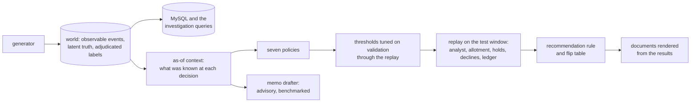

# bnpl-fraud-workbench

How a small BNPL fraud team should spend limited review capacity: rules,
machine-learning and hybrid policies compared on a synthetic pay-in-4 world with
late-arriving evidence, a shipping deadline and the cost of turning away good
customers.

## The question

A pay-in-4 platform's fraud team has a fixed amount of analyst time. Evidence about
an order keeps arriving after checkout (a verification answer, a missed installment,
a cardholder's dispute), fraud labels take weeks to settle, and merchants ship within
hours, so a review that finishes late cannot stop the goods. Holding or declining a
good customer costs money too. Which review-and-intervention policy should the team
run, and when does that answer change?

The workbench answers this on simulated marketplaces. It generates worlds in which
customers, fraudsters and merchants act through the same events, replays seven
candidate policies on the same orders with a simulated analyst, a fixed allotment of
review minutes and a cash ledger, and chooses between them with a rule written down
before the final results existed. The [operating review](reports/operating-review.md)
is the decision memo; the appendices hold the tables behind it.

## The answer

**Replace today's rules with the gradient-boosting policy, after a pilot.** The recommendation rule, written down before the final results, selects it in the primary cell: the baseline world at the base review allotment. The rule uses *rule net contribution*: the ledger's net cash minus the cost of lost customers and the analyst allotment. Gradient boosting's mean gain against today's rules is {{ evaluate.rule_net_per_1000_orders.vs_incumbent_rules.baseline.base.boosting | usd:signed }} per 1,000 orders decided. This clears the rule's ${{ protocol:reporting.recommendation_rule.hurdle.mean_improvement_usd_per_1000_orders }} hurdle for a policy change. The gain is {{ evaluate.rule_net_per_1000_orders.vs_incumbent_rules.baseline.base.boosting | signs }}. The test window contains an average of {{ cell:replay.outcomes where family=baseline capacity_level=base layout=current history=policy reviewer=evidence verification=verification policy=incumbent_rules mean orders by policy | orders num:0 }} orders decided per world across the {{ cell:replay.outcomes where family=baseline capacity_level=base layout=current history=policy reviewer=evidence verification=verification policy=boosting sum review_band by policy | rows_count count }} simulated worlds. Today's rules send about {{ cell:replay.outcomes where family=baseline capacity_level=base layout=current history=policy reviewer=evidence verification=verification policy=incumbent_rules mean reviews by policy | reviews num:0 }} to review; gradient boosting sends about {{ cell:replay.outcomes where family=baseline capacity_level=base layout=current history=policy reviewer=evidence verification=verification policy=boosting mean reviews by policy | reviews num:0 }}.

Gradient boosting acts mainly through score-based declines at checkout. It loses {{ evaluate.rule_lost_legitimate_per_10k.baseline.base.boosting | num:1 }} legitimate customers per 10,000 legitimate orders on average, inside the guardrail of {{ protocol:reporting.recommendation_rule.eligibility.lost_legitimate_per_10000.mean_at_most }}, against {{ evaluate.rule_lost_legitimate_per_10k.baseline.base.incumbent_rules | num:1 }} under today's rules. Their cost is already deducted from its gain. Logistic regression has the highest mean gain in the table below, but loses {{ evaluate.rule_lost_legitimate_per_10k.baseline.base.logistic | num:1 }} legitimate customers per 10,000 legitimate orders, over the guardrail, so the rule cannot choose it. Today's rules miss the queue's P1 and P2 service targets ({{ config:policy:sla.target_hours.P1 }} and {{ config:policy:sla.target_hours.P2 }} service hours), so the rule holds challengers to today's level at each priority. Gradient boosting meets that level at both.

The recommendation holds in {{ evaluate.recommendation.holds | numerator }} of the {{ evaluate.recommendation.holds | denominator }} other operating cells. Each changes one condition from the primary cell: the world (an acquisition surge, a fraud-mix shift, or goods shipping in half or twice the time), the review allotment, the shift layout, the verification rates, or the value put on a lost customer. When an acquisition campaign doubles the inflow of new customers, gradient boosting loses {{ evaluate.rule_lost_legitimate_per_10k.acquisition_surge.base.boosting | num:1 }} legitimate customers per 10,000 legitimate orders, over the guardrail, so today's rules stay. The [operating review](reports/operating-review.md) gives the decision, the alternatives, the staffing comparison and a pilot plan.

All results come from synthetic worlds, not from a real portfolio: they show how these policies behave under the stated assumptions, not real fraud rates. The table covers the primary cell (the baseline world at the base review allotment) on the test window, from {{ protocol:windows.test.start | date }} until {{ protocol:windows.test.end | date }}, one simulated world per seed: gains and customer rates are means over the final seeds, and fraud loss pools loss and GMV over them.

| Policy | Mean gain over the incumbent per 1,000 orders | Across seeds | Lost legitimate customers per 10,000 | Legitimate orders held per 10,000 | Fraud loss (bps of GMV) |
| --- | ---: | --- | ---: | ---: | ---: |
| approve-all | {{ evaluate.rule_net_per_1000_orders.vs_incumbent_rules.baseline.base.approve_all | usd:signed }} | {{ evaluate.rule_net_per_1000_orders.vs_incumbent_rules.baseline.base.approve_all | signs }} | {{ evaluate.rule_lost_legitimate_per_10k.baseline.base.approve_all | num:1 }} | {{ evaluate.rule_held_legitimate_per_10k.baseline.base.approve_all | num:1 }} | {{ evaluate.loss_of_gmv.baseline.base.approve_all | num:1 }} |
| incumbent rules | reference | reference | {{ evaluate.rule_lost_legitimate_per_10k.baseline.base.incumbent_rules | num:1 }} | {{ evaluate.rule_held_legitimate_per_10k.baseline.base.incumbent_rules | num:1 }} | {{ evaluate.loss_of_gmv.baseline.base.incumbent_rules | num:1 }} |
| depth-3 tree | {{ evaluate.rule_net_per_1000_orders.vs_incumbent_rules.baseline.base.tree_depth3 | usd:signed }} | {{ evaluate.rule_net_per_1000_orders.vs_incumbent_rules.baseline.base.tree_depth3 | signs }} | {{ evaluate.rule_lost_legitimate_per_10k.baseline.base.tree_depth3 | num:1 }} | {{ evaluate.rule_held_legitimate_per_10k.baseline.base.tree_depth3 | num:1 }} | {{ evaluate.loss_of_gmv.baseline.base.tree_depth3 | num:1 }} |
| logistic regression | {{ evaluate.rule_net_per_1000_orders.vs_incumbent_rules.baseline.base.logistic | usd:signed }} | {{ evaluate.rule_net_per_1000_orders.vs_incumbent_rules.baseline.base.logistic | signs }} | {{ evaluate.rule_lost_legitimate_per_10k.baseline.base.logistic | num:1 }} | {{ evaluate.rule_held_legitimate_per_10k.baseline.base.logistic | num:1 }} | {{ evaluate.loss_of_gmv.baseline.base.logistic | num:1 }} |
| gradient boosting | {{ evaluate.rule_net_per_1000_orders.vs_incumbent_rules.baseline.base.boosting | usd:signed }} | {{ evaluate.rule_net_per_1000_orders.vs_incumbent_rules.baseline.base.boosting | signs }} | {{ evaluate.rule_lost_legitimate_per_10k.baseline.base.boosting | num:1 }} | {{ evaluate.rule_held_legitimate_per_10k.baseline.base.boosting | num:1 }} | {{ evaluate.loss_of_gmv.baseline.base.boosting | num:1 }} |
| hybrid | {{ evaluate.rule_net_per_1000_orders.vs_incumbent_rules.baseline.base.hybrid | usd:signed }} | {{ evaluate.rule_net_per_1000_orders.vs_incumbent_rules.baseline.base.hybrid | signs }} | {{ evaluate.rule_lost_legitimate_per_10k.baseline.base.hybrid | num:1 }} | {{ evaluate.rule_held_legitimate_per_10k.baseline.base.hybrid | num:1 }} | {{ evaluate.loss_of_gmv.baseline.base.hybrid | num:1 }} |
| expected loss | {{ evaluate.rule_net_per_1000_orders.vs_incumbent_rules.baseline.base.expected_loss | usd:signed }} | {{ evaluate.rule_net_per_1000_orders.vs_incumbent_rules.baseline.base.expected_loss | signs }} | {{ evaluate.rule_lost_legitimate_per_10k.baseline.base.expected_loss | num:1 }} | {{ evaluate.rule_held_legitimate_per_10k.baseline.base.expected_loss | num:1 }} | {{ evaluate.loss_of_gmv.baseline.base.expected_loss | num:1 }} |

- **Mean gain over the incumbent:** rule net contribution minus the incumbent rules' in the same world, per 1,000 orders decided (processor-approved checkouts in the test window). Rule net contribution is the ledger's net cash for those orders minus ${{ config:policy:costs.false_decline_ltv_usd | num:0 }} for each lost legitimate customer and minus the analyst allotment at ${{ config:policy:costs.analyst_loaded_hourly_usd | num:0 }} an hour, charged in each world where the policy's thresholds send orders to review (gradient boosting's do in {{ cell:replay.outcomes where family=baseline capacity_level=base layout=current history=policy reviewer=evidence verification=verification policy=boosting sum review_band by policy | review_band count }} of the {{ cell:replay.outcomes where family=baseline capacity_level=base layout=current history=policy reviewer=evidence verification=verification policy=boosting sum review_band by policy | rows_count count }} worlds).
- **Across seeds:** how many worlds the gain was positive or negative in.
- **Lost legitimate customers:** legitimate orders declined at checkout, refused because the account was blocked, declined or escalated after review, or cancelled after an unanswered verification request. **Held:** legitimate orders asked to verify. Both per 10,000 legitimate orders, mean over seeds; "legitimate" means no fraud finding by the end of observation.
- **Fraud loss:** cash lost on orders labelled fraud, in basis points of gross merchandise value, pooled over seeds.

What qualifies these figures: the seeds show variation between worlds
that share one generator, not whether its parameters are right; fraudsters in the
replay do not adapt to being declined, so the value of declines and blocks can be
overstated; and the costs (the lifetime-value proxy, the analyst hour) and the
guardrails on lost and held customers are stated assumptions. The
[operating review](reports/operating-review.md) applies the recommendation rule to
these and the other operating cells; the [methods](docs/methods.md#limits) list every
assumption.


## One investigation

On {{ fact:account_takeover:alerts.account_takeover.decision.checkout_at | date }}, an account {{ fact:account_takeover:alerts.account_takeover.evidence.row.account_age_days | num:0 }} days old placed a {{ fact:account_takeover:alerts.account_takeover.evidence.row.amount_cents | usd:2 }} order. The device had been linked to the account {{ fact:account_takeover:alerts.account_takeover.evidence.row.device_link_age_hours | num:2 }} hours earlier, the account had never shipped to the address, the IP was outside the customer's home country, and the card security code check failed. Today's rules sent the order to review on {{ fact:account_takeover:alerts.account_takeover.evidence.rules_held.0 }}: the card's issuing country differed from the IP's, and a card check failed.

The same evidence could fit an established customer travelling with a new phone and
shipping away from home. The platform's written fraud policy, FP-2, calls for a check
to resolve that explanation (§6.5(b)). On the evidence available, it supports a hold for an
identity check, not a decline (§6.6(b), §5.2).

The analyst held the order before it shipped. The identity check failed on {{ fact:account_takeover:alerts.account_takeover.later.review.checks.0.completed_at | date }}, and the order was declined and voided. It was labelled an account takeover on {{ fact:account_takeover:alerts.account_takeover.later.label.label_known_at | date }}. The [case file](cases/account-takeover.md) has the evidence table, competing explanations, later outcomes and a change to the rules tested in the replay.

Five case files follow single alerts from the canonical world through the replay:
the evidence at the decision, the recommendation the fraud policy supports, the
simulated action, what happened later, and one policy change tested in the replay.
The canonical world is a development seed, so the cases illustrate the replay rather
than measure it.

| Case | What it shows |
| --- | --- |
| [Account takeover](cases/account-takeover.md) | An established account orders from a new device to a new address; held for an identity check that failed, declined before shipping. |
| [Never-pay or hardship](cases/never-pay-vs-hardship.md) | Two new customers cleared after a passed identity check: one never paid after checkout, the other paid part of its plan and then defaulted. |
| [A traveller cleared](cases/traveller.md) | A legitimate customer abroad, held for an identity check that passed, cleared and shipped. |
| [Card testing](cases/card-testing.md) | A new account's order declined at checkout on R07 and R05. |
| [A linked ring](cases/ring.md) | A ring member's order declined at checkout on R02 alone, with no account block. |

## How it works



- **The world** (`simulator/`, `core/world.py`) holds every attempted order with the
  outcomes it would have if the platform approved everything. Every event has the
  time it happened and the time the platform could know it. Three layers are kept
  apart: observable events, latent truth (who the actor really is), and an adjudicated
  label computed later from observable outcomes only. A contract validator checks
  every world's chronology.
- **The as-of context** (`core/asof.py`) builds the row each decision reads from what
  was known before it; tests check that cutting the world at any time leaves earlier
  rows unchanged and that labels and latent truth change no value
  (`tests/test_asof_context.py`).
- **The policies** (`queue_sim/policies.py`) route each order once at checkout. Their
  thresholds are tuned on the validation window through the replay itself, at the
  base allotment ([methods](docs/methods.md#threshold-tuning)).
- **The replay** (`queue_sim/replay.py`) runs each frozen policy over the test
  window. Reviewed orders wait in one priority queue for an analyst with a fixed
  allotment of minutes per shift; the simulated analyst (`queue_sim/reviewer.py`)
  follows the written fraud policy ([FP-2](policy/fraud-policy.md)) through
  `core/evidence.py`; holds, declines, escalations and account blocks change what
  happens next, and every cent goes through one ledger (`core/ledger.py`).
- **The evaluation** applies the pre-registered recommendation rule
  (`core/recommendation.py`, `experiments/protocol.yaml`) in the primary cell and in
  each sensitivity cell, and writes structured results (`results/`).
- **The documents** are rendered from `results/summary.json` (`report/`).

Policies and the simulated analyst read only observable evidence as known at each
decision. Latent truth answers the analyst's verification checks and appears only as
a labelled diagnostic; the adjudicated labels score the results.

## How to verify a number

| To check | Where it comes from | Command |
| --- | --- | --- |
| Any number in this README, the operating review or an appendix | the result key the document's template names, in `results/summary.json` | `python -m report check` |
| A sentence that compares two policies | its record in `report/claims.yaml`, tested against the per-seed results each time the documents render | `python -m report check` |
| A figure | the values it plots and their keys, in `reports/figures/<name>.json` | `python -m report.charts --check` |
| The results themselves | the protocol frozen before any final world existed, `experiments/FREEZE.json` | `make final` |
| A case file's evidence | `cases/facts/<case>.json`, built from the replay's saved rows | `python -m cases.select --run runs/final` |
| The archived memo benchmark | its cached responses, replayed offline | `make llm-history` |

`python -m report check` fails when a document differs from a fresh render of its
template, when a comparison no longer holds on the results, or when a number has been
typed into a template instead of rendered.

## Run it

Requirements: Python (the versions in `requirements.lock`), Docker for MySQL, and
`make`.

```sh
make venv        # the locked environment in .venv
make up          # MySQL in Docker, waiting until it answers
make ci-world    # one small world through every stage, into runs/ci (minutes)
make canonical   # the canonical world at full size, loaded into MySQL
make dev         # the development seeds
make final       # the final seeds; writes results/ and the documents (several hours;
                 # refused unless the protocol's frozen files are unchanged)
make docs        # render the documents and figures from results/summary.json
make check       # lint, tests and the documents check
```

`make test` skips the MySQL tests when no database answers; `make test-mysql` requires
one. The memo drafter's live calls go through the Codex and Claude command-line tools
(`CODEX_CLI_BIN`, `CLAUDE_CLI_BIN`; `config/llm.yaml`); every scored response is
cached, so the benchmarks replay offline with no calls.

## The memo drafter

The memo drafter writes an advisory investigation memo from a case packet: the
evidence, competing explanations including the benign one, the fraud-policy clauses
and a recommended next step; the analyst decides.

Its benchmark, fixed before any final case existed, scores memos on {{ bench:2026-10-final:/arms/opus/summary/n_cases | count }} analyst decisions from the final seeds' worlds. A memo passes only if its format, disposition, next check, citations and every structured claim pass. The natural-mix pass rate was {{ bench:2026-10-final:/endpoints/primary/arms/opus/natural_mix | pct }} (cluster-bootstrap interval {{ bench:2026-10-final:/endpoints/primary/arms/opus/natural_mix_cluster_bootstrap | bounds }}) for `opus`, {{ bench:2026-10-final:/pins/opus/model }} through the Claude Code CLI, and {{ bench:2026-10-final:/endpoints/primary/arms/sol/natural_mix | pct }} ({{ bench:2026-10-final:/endpoints/primary/arms/sol/natural_mix_cluster_bootstrap | bounds }}) for `sol`, {{ bench:2026-10-final:/pins/sol/model }} through the Codex CLI. The paired comparison of the two is inconclusive. The [LLM appendix](reports/appendix-llm.md) has every endpoint, what failed and the limits.

## Methods and limits

[docs/methods.md](docs/methods.md) describes the world's assumptions and the reasons
for them, the evaluation protocol, the ledger, the simulated reviewer and the limits.
The appendices give the tables behind each result:

- [Detection](reports/appendix-detection.md): each score's ranking and calibration,
  and every policy on the same replay.
- [Operations](reports/appendix-operations.md): queue, service times and staffing,
  the analyst's decisions by label, and the operating sensitivities.
- [Economics](reports/appendix-economics.md): the ledger's reconciliation, the
  economic assumptions and the lifetime-value sensitivity.
- [LLM](reports/appendix-llm.md): the memo benchmark's endpoints, the paired
  comparison of its arms, what failed and how development led to the final prompt.

## Repository map

| Path | What it holds |
| --- | --- |
| `simulator/` | the world generator |
| `core/` | contracts: the world's tables and validator, the as-of context, ledger, actions, evidence, the recommendation rule, results, statistics, the protocol check |
| `rules/`, `model/` | rule definitions and threshold tuning; the classifiers |
| `queue_sim/` | the policies, the replay and the simulated reviewer |
| `db/` | the MySQL schema, the loader and the investigation queries Q01–Q12 |
| `llm/` | the memo drafter, its packets, the referee and the benchmarks |
| `cases/` | case selection, facts and tested changes; the five case files |
| `policy/` | the written fraud policy, FP-2 |
| `config/`, `experiments/` | world, policy and LLM settings; the pre-registered protocol and its freeze |
| `pipeline.py` | the pipeline, stage by stage (`python pipeline.py stages`) |
| `results/` | stage results and `summary.json` |
| `report/`, `reports/` | templates, claims, the number lint and figure code; the operating review, appendices and figures |
| `docs/methods.md` | methods |

## License

MIT. Author: Alejandro Guerrero Padrés.
