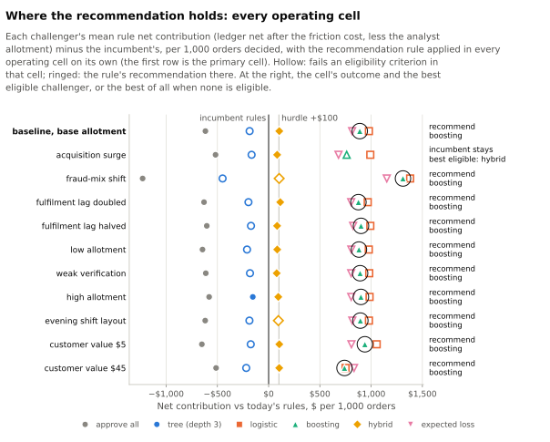

<!-- Generated by `python -m report render` from report/templates/reports/appendix-operations.md. Edit the template, not this file. -->
# Operations appendix

The review queue and its service times, staffing, the simulated analyst's decisions
by label, and the operating sensitivities. The worlds are synthetic; queue and
service figures follow from the stated review times, shift layouts and allotments
([methods](../docs/methods.md#capacity), [reviewer](../docs/methods.md#reviewer)).
Unless a table says otherwise it covers the primary cell (baseline world, base
allotment, current shift layout, each policy with its own history, the evidence-based
reviewer with standard verification) on the test window.

## The queue

How each policy routed the window's orders at checkout, totals over the final seeds' worlds:

| Policy | Orders | Fraud declined at checkout | Legitimate declined at checkout | Legitimate refused for a blocked account | Sent to review | Worlds |
|---|---:|---:|---:|---:|---:|---:|
| approve-all | 252,655 | 0 | 0 | 0 | 0 | 10 |
| incumbent rules | 252,655 | 595 | 735 | 39 | 2,565 | 10 |
| depth-3 tree | 252,655 | 415 | 1,153 | 0 | 367 | 10 |
| logistic regression | 252,655 | 1,236 | 2,779 | 7 | 1,745 | 10 |
| gradient boosting | 252,655 | 1,231 | 2,113 | 6 | 1,295 | 10 |
| hybrid | 252,655 | 623 | 841 | 11 | 2,474 | 10 |
| expected loss | 252,655 | 1,090 | 697 | 11 | 3,239 | 10 |

*Fraud declined at checkout* counts fraud orders declined there, including those refused because review had already blocked the account; *legitimate refused for a blocked account* counts legitimate orders refused that way. An order whose label is not yet known is in none of these columns. Every other order went through; one sent to review shipped unless the analyst decided or held it first.

| Policy | Reviews | Holds | Of which before shipping | Checks | Escalations | Accounts blocked | Decided after shipping | Worlds |
|---|---:|---:|---:|---:|---:|---:|---:|---:|
| approve-all | 0 | 0 | 0 | 0 | 0 | 0 | 0 | 10 |
| incumbent rules | 2,565 | 839 | 520 | 839 | 7 | 59 | 1,061 | 10 |
| depth-3 tree | 367 | 20 | 12 | 20 | 0 | 0 | 163 | 10 |
| logistic regression | 1,745 | 72 | 39 | 72 | 3 | 16 | 605 | 10 |
| gradient boosting | 1,295 | 37 | 22 | 37 | 8 | 16 | 453 | 10 |
| hybrid | 2,474 | 231 | 144 | 231 | 50 | 85 | 931 | 10 |
| expected loss | 3,239 | 85 | 52 | 85 | 10 | 34 | 1,374 | 10 |

*Reviews:* orders that entered the queue. *Holds:* orders asked to verify, before or after they shipped. A hold before shipping pauses the shipment for at most 48 hours, and an order the checks have not cleared by then is cancelled; after shipping, an unanswered request changes nothing. *Checks:* verification checks started. *Escalations:* declines that also blocked linked accounts and added 20 minutes of senior review. *Accounts blocked:* distinct accounts blocked by a review decline or escalation; their later orders are refused at checkout. *Decided after shipping:* reviews first decided after the goods shipped. All are totals over the final seeds' worlds (the last column counts them).

| Policy | Minutes of work offered | Minutes used | Of which senior review | Minutes allotted | Worlds |
|---|---:|---:|---:|---:|---:|
| approve-all | 0 | 0 | 0 | 43,230 | 10 |
| incumbent rules | 18,285 | 18,285 | 140 | 43,230 | 10 |
| depth-3 tree | 2,603 | 2,603 | 0 | 43,230 | 10 |
| logistic regression | 11,852 | 11,852 | 60 | 43,230 | 10 |
| gradient boosting | 9,409 | 9,409 | 160 | 43,230 | 10 |
| hybrid | 18,703 | 18,703 | 1,000 | 43,230 | 10 |
| expected loss | 22,682 | 22,682 | 200 | 43,230 | 10 |

*Minutes of work offered:* the review time of every order that reached the queue plus
escalations' senior review. *Minutes used:* the part of that work begun, including
work on the window's orders after the window ended. *Minutes allotted:* the
allotment of the shifts inside the window, used or not. Totals over the worlds.

| Policy | Median minutes to decision | 90th percentile | Largest backlog | Worlds |
|---|---:|---:|---:|---:|
| approve-all | 0 | 0 | 0.0 | 10 |
| incumbent rules | 530 | 1,345 | 8.2 | 10 |
| depth-3 tree | 69 | 212 | 1.1 | 10 |
| logistic regression | 352 | 662 | 4.4 | 10 |
| gradient boosting | 306 | 572 | 3.0 | 10 |
| hybrid | 556 | 1,549 | 7.7 | 10 |
| expected loss | 596 | 1,762 | 8.8 | 10 |

*Minutes to decision:* wall-clock minutes from queue entry to the analyst's first
decision, among decided reviews; the median and the 90th percentile are each world's,
then the mean over seeds. *Largest backlog:* the most orders waiting at once in a
world, mean over seeds. Approve-all sends nothing to review, so its row reads zero.

| Policy | P0 entries | P0 in time | P1 entries | P1 in time | P2 entries | P2 in time | Misses |
|---|---:|---:|---:|---:|---:|---:|---|
| approve-all | 0 | n/a | 0 | n/a | 0 | n/a | none |
| incumbent rules | 1 | 0.0% | 1,444 | 82.5% | 1,120 | 83.2% | P1 service, P2 service |
| depth-3 tree | 1 | 100.0% | 30 | 90.0% | 336 | 80.4% | P2 service |
| logistic regression | 2 | 50.0% | 718 | 83.9% | 1,025 | 90.6% | mean lost customers |
| gradient boosting | 0 | n/a | 386 | 83.6% | 909 | 90.9% | none |
| hybrid | 0 | n/a | 933 | 83.3% | 1,541 | 87.2% | none |
| expected loss | 3 | 100.0% | 2,257 | 76.8% | 979 | 73.6% | P1 service, P2 service |

*In time:* the share of the orders entering the queue at that priority that were decided within its target (1, 4 and 8 service hours for P0 to P2, counted from 08:00 to 20:00 every day; an order still undecided at the end of observation is a miss), mean over the seeds with entries. Entries are pooled over seeds; a priority with fewer than 50 pooled entries is reported but not assessed by the recommendation rule. Priority is fixed at queue entry (FP-2 §7.1); P3 does not occur because every order enters at checkout ([methods](../docs/methods.md#capacity)).

## Staffing

Each policy keeps the thresholds tuned at the base allotment. The low and high levels
change the minutes per shift; the evening layout moves the same two shifts later in
the day with the base's minutes.

| Policy | Minutes used, low (17 per shift) | Base (33) | High (50) | Evening layout | Decided after shipping, base | Evening layout |
| --- | ---: | ---: | ---: | ---: | ---: | ---: |
| approve-all | 0.0% | 0.0% | 0.0% | 0.0% | 0.0 | 0.0 |
| incumbent rules | 82.1% | 42.3% | 27.9% | 42.3% | 106.1 | 77.7 |
| depth-3 tree | 11.7% | 6.0% | 4.0% | 6.0% | 16.3 | 13.3 |
| logistic regression | 53.3% | 27.4% | 18.1% | 27.4% | 60.5 | 38.1 |
| gradient boosting | 42.2% | 21.8% | 14.4% | 21.8% | 45.3 | 31.6 |
| hybrid | 84.5% | 43.3% | 28.5% | 43.2% | 93.1 | 72.5 |
| expected loss | 102.0% | 52.5% | 34.6% | 52.5% | 137.4 | 107.5 |

*Minutes used* is the share of the window's allotted minutes that the work begun
took (it can pass the allotment by work done after the window); *decided after
shipping* is the mean per world. The rule's figures for each staffing level are in
the [operating review](operating-review.md#review-capacity-and-staffing) and below.

| World family | Orders | Minutes allotted | Minutes the incumbent's queue offered | Worlds |
|---|---:|---:|---:|---:|
| baseline | 252,655 | 43,230 | 18,285 | 10 |
| acquisition surge | 296,369 | 43,230 | 28,164 | 10 |
| fraud-mix shift | 253,541 | 43,230 | 18,004 | 10 |
| shipping time halved | 252,655 | 43,230 | 18,285 | 10 |
| shipping time doubled | 252,655 | 43,230 | 18,285 | 10 |

The allotment per shift is the same in every family, so the acquisition surge brings
its extra orders to the same minutes. Orders and minutes are totals over the worlds.

## The analyst's decisions by label

How the simulated analyst's reviews of the incumbent's queue ended, by the label each
order earned, before and after the order shipped (at the first decision). Counts are
orders summed over the final seeds' baseline worlds.

| Decided before shipping | Cleared | Declined | Escalated | Cancelled |
|---|---:|---:|---:|---:|
| account takeover | 0 | 2 | 0 | 4 |
| credit loss | 71 | 1 | 1 | 4 |
| never-pay | 26 | 6 | 2 | 6 |
| no finding | 1,274 | 8 | 2 | 76 |
| merchant bust-out | 11 | 0 | 0 | 0 |
| promotion abuse | 1 | 0 | 0 | 0 |
| third-party fraud | 1 | 6 | 0 | 2 |

| Decided after shipping | Cleared | Declined | Escalated | Unchanged |
|---|---:|---:|---:|---:|
| account takeover | 0 | 6 | 0 | 2 |
| credit loss | 35 | 1 | 0 | 4 |
| never-pay | 16 | 5 | 1 | 5 |
| no finding | 933 | 9 | 1 | 30 |
| merchant bust-out | 8 | 0 | 0 | 0 |
| third-party fraud | 1 | 1 | 0 | 3 |

*Cleared:* cleared by the analyst, at once or once the checks passed; a held order then ships. *Declined* and *escalated:* declined after a failed check or an earlier outcome that settles the order; an order not yet shipped is voided, a shipped one's loss stands, and the account is blocked (an escalation also blocks linked accounts and adds senior review). *Cancelled:* held before shipment with no answer to the checks within 48 hours, then cancelled and refunded. *Unchanged:* held after shipment with no answer, which changes nothing. The analyst reads only the evidence known at the decision, so a fraud order cleared here showed no adverse evidence or passed its checks, with nothing yet known that settled it ([methods](../docs/methods.md#procedure)).

The same decisions on the incumbent's queue by the order's latent pattern, a
diagnostic the analyst never sees ("legitimate" is no pattern; a bust-out merchant's customers are genuine):

| Latent pattern (before shipping) | Cleared | Declined | Escalated | Cancelled |
|---|---:|---:|---:|---:|
| account takeover | 0 | 4 | 0 | 4 |
| never-pay | 26 | 0 | 1 | 2 |
| promotion farm | 29 | 0 | 0 | 4 |
| stolen card | 3 | 11 | 0 | 9 |
| legitimate | 1,311 | 8 | 3 | 73 |
| merchant bust-out customer | 15 | 0 | 0 | 0 |
| synthetic ring | 0 | 0 | 1 | 0 |

| Latent pattern (after shipping) | Cleared | Declined | Escalated | Unchanged |
|---|---:|---:|---:|---:|
| account takeover | 0 | 7 | 0 | 2 |
| never-pay | 16 | 0 | 0 | 2 |
| promotion farm | 9 | 0 | 0 | 3 |
| stolen card | 3 | 7 | 0 | 9 |
| legitimate | 957 | 8 | 1 | 28 |
| merchant bust-out customer | 8 | 0 | 0 | 0 |
| synthetic ring | 0 | 0 | 1 | 0 |

The analyst's decisions on gradient boosting's queue, by label. Its chosen point has a review route on some seeds only ([detection appendix](appendix-detection.md#tuned-thresholds)), so these counts come from those seeds' worlds:

| Decided before shipping | Cleared | Declined | Escalated | Cancelled |
|---|---:|---:|---:|---:|
| account takeover | 2 | 2 | 0 | 0 |
| credit loss | 32 | 0 | 0 | 0 |
| never-pay | 18 | 0 | 3 | 1 |
| no finding | 759 | 1 | 1 | 4 |
| merchant bust-out | 10 | 0 | 0 | 0 |
| promotion abuse | 1 | 0 | 0 | 0 |
| third-party fraud | 8 | 0 | 0 | 0 |

| Decided after shipping | Cleared | Declined | Escalated | Unchanged |
|---|---:|---:|---:|---:|
| account takeover | 3 | 1 | 0 | 0 |
| credit loss | 21 | 0 | 0 | 0 |
| never-pay | 12 | 0 | 1 | 2 |
| no finding | 399 | 0 | 3 | 1 |
| merchant bust-out | 6 | 0 | 0 | 0 |
| promotion abuse | 2 | 0 | 0 | 0 |
| third-party fraud | 2 | 0 | 0 | 0 |

## Operating sensitivities

The recommendation rule was applied again in each cell that differs from the primary cell in one respect, with the primary cell's thresholds: the acquisition surge and fraud-mix shift families, goods shipping in 0.5 and 2.0 times the drawn time from the test window on, the low and high allotments, the evening layout, and weaker verification (a takeover's contact check passing at 0.50 instead of 0.25, and takeover and third-party identity checks at 0.25 instead of 0.05). The outcome in each cell is the flip table in the [operating review](operating-review.md#when-the-answer-changes); the rule's figures for every policy in each cell follow.

The recommended policy, gradient boosting, in every cell:

| Cell | Mean gain | Seeds positive | Lost per 10k | Lost per 10k (highest seed) | Held per 10k | P1 in time | P2 in time | Eligible | Misses |
|---|---:|---:|---:|---:|---:|---:|---:|---|---|
| primary cell | +$889 | 10 | 85.0 | 144.8 | 0.9 | 83.6% | 90.9% | yes | none |
| acquisition surge | +$761 | 10 | 128.4 | 211.6 | 1.0 | 73.0% | 69.1% | no | mean lost customers, lost customers on a seed |
| fraud-mix shift | +$1,311 | 10 | 89.3 | 152.0 | 1.0 | 85.0% | 92.9% | yes | none |
| shipping time doubled | +$876 | 10 | 85.1 | 144.8 | 0.9 | 83.6% | 90.9% | yes | none |
| shipping time halved | +$901 | 10 | 85.0 | 144.8 | 0.9 | 83.6% | 90.9% | yes | none |
| low allotment | +$881 | 10 | 85.0 | 144.4 | 0.9 | 54.6% | 50.9% | yes | none |
| weak verification | +$893 | 10 | 85.0 | 144.8 | 0.9 | 83.4% | 91.1% | yes | none |
| high allotment | +$900 | 10 | 85.0 | 144.8 | 0.9 | 91.0% | 98.5% | yes | none |
| evening layout | +$895 | 10 | 85.0 | 144.8 | 0.9 | 56.8% | 92.2% | yes | none |
| lifetime-value proxy, low | +$939 | 10 | 85.0 | 144.8 | 0.9 | 83.6% | 90.9% | yes | none |
| lifetime-value proxy, high | +$740 | 10 | 85.0 | 144.8 | 0.9 | 83.6% | 90.9% | yes | none |

Today's rules in every cell:

| Cell | Lost per 10k | Held per 10k | P1 in time | P2 in time | Misses |
|---|---:|---:|---:|---:|---|
| primary cell | 35.0 | 30.3 | 82.5% | 83.2% | P1 service, P2 service |
| acquisition surge | 31.9 | 31.3 | 65.2% | 47.9% | P1 service, P2 service |
| fraud-mix shift | 36.6 | 30.4 | 84.1% | 84.9% | P1 service, P2 service |
| shipping time doubled | 35.8 | 30.3 | 82.5% | 83.2% | P1 service, P2 service |
| shipping time halved | 34.4 | 30.3 | 82.5% | 83.2% | P1 service, P2 service |
| low allotment | 33.4 | 30.0 | 47.2% | 35.2% | P1 service, P2 service |
| weak verification | 35.0 | 30.3 | 82.5% | 83.2% | P1 service, P2 service |
| high allotment | 35.2 | 30.3 | 91.1% | 96.4% | none |
| evening layout | 35.5 | 30.3 | 56.5% | 84.0% | P1 service, P2 service |
| lifetime-value proxy, low | 35.0 | 30.3 | 82.5% | 83.2% | P1 service, P2 service |
| lifetime-value proxy, high | 35.0 | 30.3 | 82.5% | 83.2% | P1 service, P2 service |

A criterion today's rules miss in a cell holds each challenger there to today's level instead, so a challenger can be eligible while missing the service target itself, as boosting does at the low allotment.

World families: the rule's figures in each

| Cell | Policy | Mean gain | Seeds positive | Needed | Lost per 10k | Held per 10k | P1 entries | P1 in time | P2 entries | P2 in time | Eligible | Misses |
|---|---|---:|---:|---:|---:|---:|---:|---:|---:|---:|---|---|
| acquisition surge | approve-all | -$518 | 0 | 9 | 0.0 | 0.0 | 0 | n/a | 0 | n/a | yes | none |
| acquisition surge | incumbent rules | n/a | n/a | n/a | 31.9 | 31.3 | 2,168 | 65.2% | 1,761 | 47.9% | n/a | P1 service, P2 service |
| acquisition surge | depth-3 tree | -$166 | 2 | 9 | 65.3 | 0.6 | 46 | 65.2% | 571 | 22.6% | no | P2 service |
| acquisition surge | logistic regression | +$992 | 10 | 9 | 184.3 | 2.1 | 1,192 | 67.2% | 1,982 | 61.3% | no | mean lost customers, lost customers on a seed |
| acquisition surge | gradient boosting | +$761 | 10 | 9 | 128.4 | 1.0 | 674 | 73.0% | 1,709 | 69.1% | no | mean lost customers, lost customers on a seed |
| acquisition surge | hybrid | +$83 | 10 | 9 | 32.5 | 4.1 | 1,362 | 76.0% | 2,560 | 72.0% | yes | none |
| acquisition surge | expected loss | +$682 | 10 | 9 | 38.4 | 2.3 | 3,730 | 58.3% | 1,799 | 35.6% | no | P1 service, P2 service |
| fraud-mix shift | approve-all | -$1,229 | 0 | 9 | 0.0 | 0.0 | 0 | n/a | 0 | n/a | yes | none |
| fraud-mix shift | incumbent rules | n/a | n/a | n/a | 36.6 | 30.4 | 1,468 | 84.1% | 1,141 | 84.9% | n/a | P1 service, P2 service |
| fraud-mix shift | depth-3 tree | -$449 | 1 | 9 | 48.0 | 0.7 | 30 | 83.3% | 336 | 83.9% | no | P2 service |
| fraud-mix shift | logistic regression | +$1,380 | 10 | 9 | 115.9 | 2.1 | 729 | 83.9% | 1,037 | 87.9% | no | mean lost customers, P1 service |
| fraud-mix shift | gradient boosting | +$1,311 | 10 | 9 | 89.3 | 1.0 | 401 | 85.0% | 929 | 92.9% | yes | none |
| fraud-mix shift | hybrid | +$103 | 10 | 9 | 37.2 | 3.5 | 1,080 | 83.2% | 1,727 | 84.9% | no | P1 service, P2 service |
| fraud-mix shift | expected loss | +$1,153 | 10 | 9 | 32.5 | 2.0 | 2,314 | 77.1% | 1,016 | 72.5% | no | P1 service, P2 service |
| shipping time doubled | approve-all | -$630 | 0 | 9 | 0.0 | 0.0 | 0 | n/a | 0 | n/a | yes | none |
| shipping time doubled | incumbent rules | n/a | n/a | n/a | 35.8 | 30.3 | 1,444 | 82.5% | 1,120 | 83.2% | n/a | P1 service, P2 service |
| shipping time doubled | depth-3 tree | -$197 | 2 | 9 | 46.0 | 0.6 | 30 | 90.0% | 336 | 80.4% | no | P2 service |
| shipping time doubled | logistic regression | +$967 | 10 | 9 | 111.7 | 2.0 | 718 | 83.9% | 1,025 | 90.6% | no | mean lost customers |
| shipping time doubled | gradient boosting | +$876 | 10 | 9 | 85.1 | 0.9 | 386 | 83.6% | 909 | 90.9% | yes | none |
| shipping time doubled | hybrid | +$113 | 9 | 9 | 35.4 | 3.3 | 933 | 83.3% | 1,541 | 87.2% | yes | none |
| shipping time doubled | expected loss | +$805 | 10 | 9 | 28.7 | 1.8 | 2,257 | 76.8% | 980 | 73.6% | no | P1 service, P2 service |
| shipping time halved | approve-all | -$603 | 0 | 9 | 0.0 | 0.0 | 0 | n/a | 0 | n/a | yes | none |
| shipping time halved | incumbent rules | n/a | n/a | n/a | 34.4 | 30.3 | 1,444 | 82.5% | 1,120 | 83.2% | n/a | P1 service, P2 service |
| shipping time halved | depth-3 tree | -$172 | 2 | 9 | 46.0 | 0.6 | 30 | 90.0% | 336 | 80.4% | no | P2 service |
| shipping time halved | logistic regression | +$992 | 10 | 9 | 111.3 | 2.0 | 718 | 83.9% | 1,025 | 90.6% | no | mean lost customers |
| shipping time halved | gradient boosting | +$901 | 10 | 9 | 85.0 | 0.9 | 386 | 83.6% | 909 | 90.9% | yes | none |
| shipping time halved | hybrid | +$83 | 10 | 9 | 35.0 | 3.3 | 932 | 83.3% | 1,541 | 87.2% | yes | none |
| shipping time halved | expected loss | +$824 | 10 | 9 | 28.6 | 1.8 | 2,257 | 76.8% | 979 | 73.6% | no | P1 service, P2 service |

Allotment and shift layout: the rule's figures in each

| Cell | Policy | Mean gain | Seeds positive | Needed | Lost per 10k | Held per 10k | P1 entries | P1 in time | P2 entries | P2 in time | Eligible | Misses |
|---|---|---:|---:|---:|---:|---:|---:|---:|---:|---:|---|---|
| low allotment | approve-all | -$645 | 0 | 9 | 0.0 | 0.0 | 0 | n/a | 0 | n/a | yes | none |
| low allotment | incumbent rules | n/a | n/a | n/a | 33.4 | 30.0 | 1,445 | 47.2% | 1,120 | 35.2% | n/a | P1 service, P2 service |
| low allotment | depth-3 tree | -$211 | 2 | 9 | 46.0 | 0.6 | 30 | 53.3% | 336 | 7.1% | no | P2 service |
| low allotment | logistic regression | +$977 | 10 | 9 | 111.4 | 2.0 | 718 | 49.5% | 1,025 | 41.4% | no | mean lost customers |
| low allotment | gradient boosting | +$881 | 10 | 9 | 85.0 | 0.9 | 386 | 54.6% | 909 | 50.9% | yes | none |
| low allotment | hybrid | +$84 | 9 | 9 | 34.9 | 3.3 | 937 | 54.4% | 1,540 | 47.4% | yes | none |
| low allotment | expected loss | +$807 | 10 | 9 | 28.3 | 1.7 | 2,259 | 38.7% | 980 | 15.0% | no | P1 service, P2 service |
| high allotment | approve-all | -$580 | 0 | 9 | 0.0 | 0.0 | 0 | n/a | 0 | n/a | yes | none |
| high allotment | incumbent rules | n/a | n/a | n/a | 35.2 | 30.3 | 1,444 | 91.1% | 1,120 | 96.4% | n/a | none |
| high allotment | depth-3 tree | -$154 | 3 | 9 | 46.1 | 0.6 | 30 | 86.7% | 336 | 94.6% | yes | none |
| high allotment | logistic regression | +$985 | 10 | 9 | 111.5 | 2.0 | 718 | 90.8% | 1,025 | 98.3% | no | mean lost customers |
| high allotment | gradient boosting | +$900 | 10 | 9 | 85.0 | 0.9 | 386 | 91.0% | 909 | 98.5% | yes | none |
| high allotment | hybrid | +$94 | 9 | 9 | 35.2 | 3.3 | 931 | 90.5% | 1,541 | 97.1% | yes | none |
| high allotment | expected loss | +$806 | 10 | 9 | 28.7 | 1.8 | 2,257 | 89.2% | 979 | 96.1% | no | P1 service |

| Cell | Policy | Mean gain | Seeds positive | Needed | Lost per 10k | Held per 10k | P1 entries | P1 in time | P2 entries | P2 in time | Eligible | Misses |
|---|---|---:|---:|---:|---:|---:|---:|---:|---:|---:|---|---|
| evening layout | approve-all | -$619 | 0 | 9 | 0.0 | 0.0 | 0 | n/a | 0 | n/a | yes | none |
| evening layout | incumbent rules | n/a | n/a | n/a | 35.5 | 30.3 | 1,444 | 56.5% | 1,120 | 84.0% | n/a | P1 service, P2 service |
| evening layout | depth-3 tree | -$187 | 1 | 9 | 45.9 | 0.6 | 30 | 53.3% | 336 | 81.0% | no | P2 service |
| evening layout | logistic regression | +$979 | 10 | 9 | 111.5 | 2.0 | 718 | 60.5% | 1,025 | 89.6% | no | mean lost customers |
| evening layout | gradient boosting | +$895 | 10 | 9 | 85.0 | 0.9 | 386 | 56.8% | 909 | 92.2% | yes | none |
| evening layout | hybrid | +$95 | 9 | 9 | 35.2 | 3.3 | 932 | 56.4% | 1,542 | 87.9% | no | P1 service |
| evening layout | expected loss | +$816 | 10 | 9 | 28.7 | 1.8 | 2,257 | 52.0% | 979 | 75.8% | no | P1 service, P2 service |

Weak verification: the rule's figures

| Cell | Policy | Mean gain | Seeds positive | Needed | Lost per 10k | Held per 10k | P1 entries | P1 in time | P2 entries | P2 in time | Eligible | Misses |
|---|---|---:|---:|---:|---:|---:|---:|---:|---:|---:|---|---|
| weak verification | approve-all | -$613 | 0 | 9 | 0.0 | 0.0 | 0 | n/a | 0 | n/a | yes | none |
| weak verification | incumbent rules | n/a | n/a | n/a | 35.0 | 30.3 | 1,444 | 82.5% | 1,120 | 83.2% | n/a | P1 service, P2 service |
| weak verification | depth-3 tree | -$182 | 3 | 9 | 46.0 | 0.6 | 30 | 90.0% | 336 | 80.4% | no | P2 service |
| weak verification | logistic regression | +$981 | 10 | 9 | 111.5 | 2.0 | 718 | 83.9% | 1,025 | 90.6% | no | mean lost customers |
| weak verification | gradient boosting | +$893 | 10 | 9 | 85.0 | 0.9 | 386 | 83.4% | 909 | 91.1% | yes | none |
| weak verification | hybrid | +$79 | 9 | 9 | 35.0 | 3.3 | 935 | 83.8% | 1,541 | 87.7% | yes | none |
| weak verification | expected loss | +$805 | 10 | 9 | 28.5 | 1.8 | 2,258 | 76.9% | 979 | 73.4% | no | P1 service, P2 service |

*Mean gain:* rule net contribution against the incumbent per 1,000 orders decided,
as in the operating review; lost and held customers per 10,000 legitimate orders,
mean over seeds; entries pooled over seeds, and a priority with too few entries is not
assessed, whatever its share in time. P0 entries are too few to assess in any cell.

## A reviewer who always knows the truth (a diagnostic)

The same thresholds, shifts, allotment and review times with an analyst who declines
every order generated as fraud or abuse and clears the rest at review completion,
without checks. The analyst's decisions still feed back through the replay: the
accounts it blocks and the history later orders are scored on change, and with them
the queue and its timing. The difference is therefore the whole effect of a reviewer
who knows the truth. It is not part of the recommendation rule. Its declines include the genuine customers of a bust-out merchant
([methods](../docs/methods.md#upper-bound)).

| Policy | Ledger net, evidence-based reviewer | Ledger net, all-knowing reviewer | Difference | Fraud loss difference | Legitimate declined difference per 10,000 |
| --- | ---: | ---: | ---: | ---: | ---: |
| approve-all | $92,398 | $92,398 | $0 | 0.0 bps | 0.0 |
| incumbent rules | $111,583 | $114,631 | +$3,048 | -5.5 bps | +1.1 |
| depth-3 tree | $105,302 | $105,669 | +$368 | -0.6 bps | +0.1 |
| logistic regression | $138,414 | $140,685 | +$2,271 | -4.5 bps | +2.1 |
| gradient boosting | $134,917 | $136,670 | +$1,753 | -3.4 bps | +1.4 |
| hybrid | $114,462 | $129,406 | +$14,944 | -28.4 bps | +7.4 |
| expected loss | $131,917 | $137,502 | +$5,585 | -9.4 bps | +3.6 |

*Ledger net* is the mean over seeds of each world's net cash for the test window's
orders; the differences are the all-knowing reviewer minus the evidence-based one.
