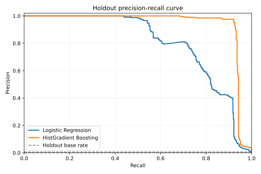
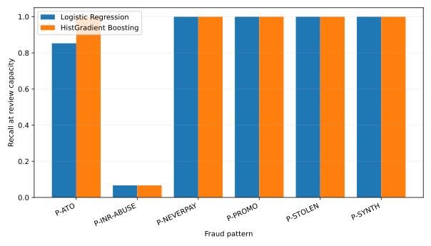

# Fraud model evaluation

Chronological holdout: 2026-04-01 00:09:52 through 2026-06-25 23:52:59.

Orders: 82,717; fraud orders: 316; base rate: 0.382%.

Review capacity: 40/day × 85 days = 3,400.

## Detection performance

| Model | PR-AUC | Precision@3,400 | Capacity threshold |
| --- | --- | --- | --- |
| Logistic Regression | 0.7337 | 8.74% | 0.332514 |
| HistGradient Boosting | 0.9455 | 9.03% | 0.169903 |

PR-AUC is reported instead of ROC-AUC because ROC-AUC can look strong while obscuring false
positives at this 0.38% fraud base rate. PR-AUC measures performance on the rare
positive class, while precision@capacity reflects the actual review constraint.



## Calibration deciles

Each bin contains one score-decile of holdout orders; predicted probability is compared with
the observed fraud rate. Because training uses `class_weight='balanced'`, the reported
probabilities are inflated by design. PR-AUC and precision@capacity are rank metrics and do not
depend on probability calibration; the cost-optimal threshold is chosen by a score sweep, not by
reading the score as a probability.

Reporting that diagnostic and stopping there leaves the useful half undone, so the raw score
is also passed through an isotonic map fitted on the last 30 days of the training
window (2026-03-02 onward: 28,441 orders, 209 fraud). `mean_calibrated` below
is that map applied to the holdout. The calibrator is a separate head with a separate purpose
— isotonic regression is monotone, so it cannot reorder anything and cannot move PR-AUC or
precision@capacity by construction. What it changes is whether the number can be read as a
probability, which is what a credit limit or exposure decision needs and a rank does not.

| Model | Brier (raw) | Brier (isotonic) | ECE (raw) | ECE (isotonic) |
| --- | --- | --- | --- | --- |
| Logistic Regression | 0.015889 | 0.001750 | 0.0436 | 0.0005 |
| HistGradient Boosting | 0.004256 | 0.000532 | 0.0176 | 0.0001 |

Expected calibration error is the order-weighted mean gap between predicted probability and
observed rate across the same deciles, so it is the tables below read as one figure.

The slice sits inside the training window rather than outside it: the committed model artifacts
are trained on the full pre-holdout period, and refitting to carve out a clean calibration month
would change every number in this report. The fitted map is therefore optimistic, because it
learns from scores the model has already seen. A production calibrator would be fitted on data
the ranking model never touched.

### Logistic Regression

| bin | orders | min_score | max_score | mean_predicted | mean_calibrated | observed_rate |
| --- | --- | --- | --- | --- | --- | --- |
| 1 | 8272 | 0.0000 | 0.0000 | 0.0000 | 0.0000 | 0.0001 |
| 2 | 8272 | 0.0000 | 0.0000 | 0.0000 | 0.0000 | 0.0001 |
| 3 | 8272 | 0.0000 | 0.0001 | 0.0001 | 0.0000 | 0.0000 |
| 4 | 8271 | 0.0001 | 0.0005 | 0.0003 | 0.0000 | 0.0000 |
| 5 | 8272 | 0.0005 | 0.0018 | 0.0011 | 0.0000 | 0.0000 |
| 6 | 8272 | 0.0019 | 0.0055 | 0.0034 | 0.0000 | 0.0001 |
| 7 | 8271 | 0.0055 | 0.0149 | 0.0095 | 0.0000 | 0.0002 |
| 8 | 8272 | 0.0149 | 0.0403 | 0.0256 | 0.0000 | 0.0001 |
| 9 | 8272 | 0.0403 | 0.1269 | 0.0726 | 0.0005 | 0.0008 |
| 10 | 8271 | 0.1270 | 1.0000 | 0.3610 | 0.0409 | 0.0366 |
### HistGradient Boosting

| bin | orders | min_score | max_score | mean_predicted | mean_calibrated | observed_rate |
| --- | --- | --- | --- | --- | --- | --- |
| 1 | 8272 | 0.0000 | 0.0001 | 0.0001 | 0.0000 | 0.0000 |
| 2 | 8272 | 0.0001 | 0.0002 | 0.0001 | 0.0000 | 0.0000 |
| 3 | 8272 | 0.0002 | 0.0002 | 0.0002 | 0.0000 | 0.0000 |
| 4 | 8271 | 0.0002 | 0.0002 | 0.0002 | 0.0000 | 0.0000 |
| 5 | 8272 | 0.0002 | 0.0002 | 0.0002 | 0.0000 | 0.0000 |
| 6 | 8272 | 0.0002 | 0.0003 | 0.0003 | 0.0000 | 0.0000 |
| 7 | 8271 | 0.0003 | 0.0003 | 0.0003 | 0.0000 | 0.0000 |
| 8 | 8272 | 0.0003 | 0.0005 | 0.0004 | 0.0000 | 0.0000 |
| 9 | 8272 | 0.0005 | 0.0476 | 0.0161 | 0.0000 | 0.0005 |
| 10 | 8271 | 0.0476 | 0.9999 | 0.1965 | 0.0379 | 0.0377 |

## Recall by fraud pattern at capacity

| Pattern | Fraud orders | Logistic Regression | HistGradient Boosting |
| --- | --- | --- | --- |
| P-ATO | 50 | 82.00% | 100.00% |
| P-INR-ABUSE | 14 | 28.57% | 35.71% |
| P-NEVERPAY | 63 | 100.00% | 100.00% |
| P-PROMO | 95 | 100.00% | 100.00% |
| P-STOLEN | 94 | 100.00% | 100.00% |



## Holdout oracle frontier (threshold chosen on this holdout)

| Model | Threshold | Alerts | TP | FP | Fraud $ caught | Total cost |
| --- | --- | --- | --- | --- | --- | --- |
| Logistic Regression | 0.826277 | 418 | 245 | 173 | $55,223.96 | $16,955.33 |
| HistGradient Boosting | 0.942612 | 331 | 297 | 34 | $65,301.31 | $2,112.72 |

Total cost counts realized principal not collected on missed fraud, $2.50
per alert, and the configured margin-plus-LTV insult cost on false positives. A caught fraud
avoids its realized loss exposure; successful down and installment payments reduce that exposure.

## Fraud-dollar comparison at review capacity

The higher-PR-AUC model (HistGradient Boosting) supplies the model ranking.

| Strategy | Reviewed | Fraud $ caught |
| --- | --- | --- |
| Rules alerts | 2119 | $37,847.30 |
| Model top-k | 3400 | $65,447.10 |
| Hybrid (half rules / half model) | 3400 | $65,447.12 |

Hybrid takes up to half of capacity from ranked rules alerts and fills the remainder from the model ranking without duplicate reviews. Rules exhaust their alert supply below the configured review capacity.

## Limitations of this holdout

- Separability is partly structural: `ship_addr_is_new` is true for 45.5% of fraud
  orders versus 0.1% of benign orders because benign addresses use
  `added_ts = signup_ts` and benign signups skew old. `account_age_days` carries the
  same structure, and the rules result of 0 false auto-declines follows from it.
- The benign R03 geo-mismatch base rate is inflated because simulated home-IP country
  is independent of KYC country for about 25% of users. Workload and CASE-05 suppression
  counts measure that simulated population and will change after the planned geo fix.
- P-SYNTH and P-MERCH have zero holdout orders; their episodes end before month 10.
  Holdout metrics cover five of seven injected patterns.
- Never-pay labels include a 30% benign-looking branch (150 accounts) that pays one
  installment, stricter than the written policy definition.

```json
{"base_rate": 0.00382, "best_model": "HistGradient Boosting", "calibration": {"models": {"HistGradient Boosting": {"brier_isotonic": 0.000532, "brier_raw": 0.004256, "ece_isotonic": 7e-05, "ece_raw": 0.017626}, "Logistic Regression": {"brier_isotonic": 0.00175, "brier_raw": 0.015889, "ece_isotonic": 0.000533, "ece_raw": 0.043569}}, "slice_fraud_orders": 209, "slice_orders": 28441, "slice_start": "2026-03-02"}, "capacity": 3400, "fraud_orders": 316, "holdout_days": 85, "holdout_end": "2026-06-25 23:52:59", "holdout_start": "2026-04-01", "models": {"HistGradient Boosting": {"pr_auc": 0.9455, "precision_at_capacity": 0.0903}, "Logistic Regression": {"pr_auc": 0.7337, "precision_at_capacity": 0.0874}}, "orders": 82717, "recall_by_pattern": {"P-ATO": {"HistGradient Boosting": 1.0, "Logistic Regression": 0.82}, "P-INR-ABUSE": {"HistGradient Boosting": 0.3571, "Logistic Regression": 0.2857}, "P-NEVERPAY": {"HistGradient Boosting": 1.0, "Logistic Regression": 1.0}, "P-PROMO": {"HistGradient Boosting": 1.0, "Logistic Regression": 1.0}, "P-STOLEN": {"HistGradient Boosting": 1.0, "Logistic Regression": 1.0}}}
```
