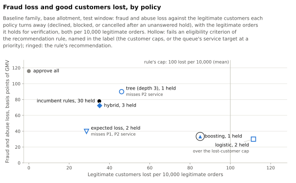
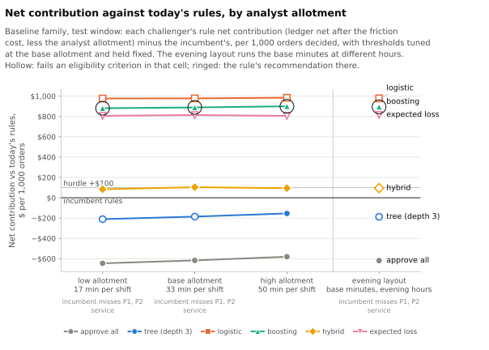

<!-- Generated by `python -m report render` from report/templates/reports/operating-review.md. Edit the template, not this file. -->
# Operating review: which review policy to run

**For** the fraud operations lead. **The question:** which review-and-intervention
policy should a small pay-in-4 fraud team run, with a fixed allotment of analyst
time, evidence and labels that arrive late, goods that ship within hours, and a real
cost to holding or declining good customers? And when does the answer change?

**The evidence** is simulated, not a real portfolio: synthetic marketplaces generated from one set of stated assumptions ([methods](../docs/methods.md)). Every policy was tuned on an earlier window and frozen, then replayed on the orders placed in the test window, from 1 June 2025 until 1 September 2025, with outcomes observed until 30 December 2025. Each final seed is one simulated world; figures are means over those worlds, and a paired difference is said to be "positive on k of n seeds" when it is above zero in k of the n worlds.

Unless a table says otherwise, figures are for the **primary cell**: the baseline
world, the base allotment on the current shift layout, each policy seeing the history
its own decisions produced, and the evidence-based reviewer with standard
verification rates.

## Decision

**Replace today's rules with the gradient-boosting policy, after a pilot.** In the primary cell, it is the eligible challenger with the highest mean gain in rule net contribution against today's rules: +$889 per 1,000 orders decided, clearing the hurdle of $100. The gain is positive on 10/10 seeds.

The policy acts mainly through score-based declines at checkout ([operations appendix](appendix-operations.md#the-queue)). It loses 85.0 legitimate customers per 10,000 legitimate orders on average, inside the guardrail of 100, against 35.0 under today's rules. The cost of those customers, at the lifetime-value proxy, is already deducted from its gain.

**Today's rules miss the service target.** At P1 and P2, their share of queue entries decided within the target does not meet the required share (table below), so the rule uses today's level as the service criterion for challengers at both priorities. Gradient boosting meets the P2 target and today's level at P1, where it still misses the target.

**The answer holds in 9 of the 10 other operating cells.** In the acquisition surge of new customers, gradient boosting misses the guardrail on lost legitimate customers, so today's rules stay ([When the answer changes](#when-the-answer-changes)). The world is synthetic, so these are results about how the policies behave under stated assumptions, not estimates for a real book ([Limits](#limits-that-bear-on-this-decision)).

## The options and the rule that chooses

Seven policies saw the same orders, the same simulated analyst, the same allotment
of review time and the same cash ledger. Each routes an order once, at checkout:
decline it, send it to review, or approve it.

| Policy | Sends to review | Declines at checkout |
| --- | --- | --- |
| approve-all (reference) | nothing | nothing |
| incumbent rules | orders whose fraud-policy rule weights (FP-2 §6.2) sum to the review threshold | orders whose rule weights sum to the decline threshold |
| depth-3 tree | a decision tree's score on four features named in advance: account age, the device's age on the account, recent accounts on the device, and the amount against its category's median | the same score at the decline threshold |
| logistic regression | its score on the context's model features | the same score at the decline threshold |
| gradient boosting | its score on the same features | the same score at the decline threshold |
| hybrid | the gradient-boosting score | the rule score |
| expected loss | calibrated fraud probability times the cash at risk | orders where the expected loss avoided covers the expected cost of declining a good customer |

Every policy's thresholds were chosen on the validation window through the same
replay, before the test window was seen ([methods](../docs/methods.md#threshold-tuning)).
A rule written down before any final world existed then chooses among them:

- **Eligibility.** Lost legitimate customers (below) within 100 per 10,000 legitimate orders on the mean over seeds and within 200 on every seed; legitimate orders held within 300 and 600; and at each queue priority, a minimum share of 0.90 of the entries decided within the service target (a priority without enough entries is reported, not assessed). Where today's rules miss a criterion, challengers are held only to today's level on it.
- **Hurdle.** A mean gain in rule net contribution over the incumbent of $100 per 1,000 orders decided or above, an allowance for the cost of changing a policy, and a positive gain on nearly every seed (the count needed is in the table). This is a consistency bar across simulated worlds, not a significance test.
- **Choice.** Among eligible challengers that clear the hurdle, the one with the highest mean gain. If none clears it, the incumbent stays.

| Policy | Mean gain | Lowest seed | Highest seed | Seeds positive | Needed | Eligible | Misses | Recommended |
|---|---:|---:|---:|---:|---:|---|---|---|
| approve-all | -$617 | -$857 | -$286 | 0 | 9 | yes | none | no |
| incumbent rules | n/a | n/a | n/a | n/a | n/a | n/a | P1 service, P2 service | no |
| depth-3 tree | -$186 | -$730 | +$102 | 2 | 9 | no | P2 service | no |
| logistic regression | +$978 | +$567 | +$1,253 | 10 | 9 | no | mean lost customers | no |
| gradient boosting | +$889 | +$587 | +$1,114 | 10 | 9 | yes | none | yes |
| hybrid | +$104 | -$38 | +$232 | 9 | 9 | yes | none | no |
| expected loss | +$814 | +$501 | +$1,196 | 10 | 9 | no | P1 service, P2 service | no |

*Mean gain:* the policy's rule net contribution minus the incumbent's in the same world, per 1,000 orders decided, mean over seeds. These are processor-approved checkouts in the test window. *Rule net contribution* is the ledger's net cash for the window's orders, minus $15 (the lifetime-value proxy) for each lost legitimate customer and minus the analyst allotment at $35 an hour, unused minutes included; a policy that sends nothing to review is charged no allotment. *Misses:* the criteria a policy fails; for the incumbent, which is the reference and has no gain of its own, the criteria today's rules miss.

## Customers, service and loss

| Policy | Lost per 10k (mean) | Lost per 10k (highest seed) | Held per 10k (mean) | P1 entries | P1 in time | P2 entries | P2 in time |
|---|---:|---:|---:|---:|---:|---:|---:|
| approve-all | 0.0 | 0.0 | 0.0 | 0 | n/a | 0 | n/a |
| incumbent rules | 35.0 | 43.4 | 30.3 | 1,444 | 82.5% | 1,120 | 83.2% |
| depth-3 tree | 46.0 | 120.4 | 0.6 | 30 | 90.0% | 336 | 80.4% |
| logistic regression | 111.5 | 159.6 | 2.0 | 718 | 83.9% | 1,025 | 90.6% |
| gradient boosting | 85.0 | 144.8 | 0.9 | 386 | 83.6% | 909 | 90.9% |
| hybrid | 35.1 | 71.4 | 3.3 | 933 | 83.3% | 1,541 | 87.2% |
| expected loss | 28.6 | 45.7 | 1.8 | 2,257 | 76.8% | 979 | 73.6% |

*Lost legitimate customers:* legitimate orders declined at checkout, refused because the account had been blocked, declined or escalated after review, or cancelled after a verification request nobody answered, per 10,000 legitimate orders. *Held:* legitimate orders asked to verify, per 10,000 legitimate orders. "Legitimate" is the adjudicated label at the end of observation: no fraud finding, credit losses included. *In time:* the share of the orders entering the review queue at that priority that were decided within its target (4 service hours for P1, 8 for P2, counted from 08:00 to 20:00 every day), mean over seeds; entries are pooled over seeds. P0 entries are too few to assess in this world ([operations appendix](appendix-operations.md)).

| Policy | Ledger net against approve-all | Fraud loss (bps of GMV) | Legitimate declined per 10,000 | Review minutes used | Decided after shipping |
| --- | ---: | ---: | ---: | ---: | ---: |
| approve-all | reference | 115.9 | 0.0 | 0.0% | 0.0 |
| incumbent rules | +$19,185 | 77.9 | 31.8 | 42.3% | 106.1 |
| depth-3 tree | +$12,904 | 89.9 | 46.0 | 6.0% | 16.3 |
| logistic regression | +$46,016 | 30.0 | 111.2 | 27.4% | 60.5 |
| gradient boosting | +$42,519 | 33.4 | 84.7 | 21.8% | 45.3 |
| hybrid | +$22,064 | 72.3 | 34.7 | 43.3% | 93.1 |
| expected loss | +$39,519 | 39.8 | 28.5 | 52.5% | 137.4 |

*Ledger net against approve-all:* the policy's net cash for the window's orders minus
approve-all's in the same world, mean over seeds, before any friction or staffing
cost. *Fraud loss:* cash lost on orders labelled fraud, in basis points of the
window's gross merchandise value. *Legitimate declined:* as lost customers, without
the cancelled holds, pooled over seeds. *Review minutes used:* minutes of review work
begun on the window's orders (including work finished after it ended) over the
minutes allotted to the queue during the window. *Decided after shipping:* reviews
whose first decision came after the goods had shipped, when a hold can no longer
stop the shipment; mean per world.

The incumbent rules kept more net cash than approve-all on 10 of 10 seeds (exact sign test, p = 0.002). Two challengers are eligible and clear the hurdle: gradient boosting and the hybrid policy. Gradient boosting has the highest mean gain among them.

The hybrid policy keeps today's rules for declines and uses the boosting score to select orders for review. Its mean gain is +$104 per 1,000 orders decided, with 35.1 legitimate customers lost per 10,000 legitimate orders, against 35.0 under today's rules. The hybrid policy lost a smaller share of GMV to fraud and abuse than the incumbent rules on 10 of 10 seeds (exact sign test, p = 0.002). An exact sign test over 10 seeds detected no difference in legitimate orders declined per 10,000 legitimate orders between the hybrid policy and the incumbent rules (3 higher, 7 lower, p = 0.344).

Logistic regression has the highest mean gain of all, +$978 per 1,000 orders decided, but is ineligible: its mean loss of 111.5 legitimate customers per 10,000 legitimate orders is over the guardrail. The logistic regression declined a larger share of legitimate orders than the incumbent rules on 10 of 10 seeds (exact sign test, p = 0.002).

The expected-loss policy uses 52.5% of the allotted review minutes and misses today's service level at both priorities.

## Review capacity and staffing

Capacity here is analyst time allotted to the fraud queue: one analyst on each covered shift, with 33 minutes per shift for review and escalation work at the base level. At this world's volume a single analyst's shift could clear the whole queue many times over, so headcount cannot be the binding limit; the allotment is. The base was sized on today's queue before any policy comparison was read ([methods](../docs/methods.md#capacity)).

The table varies the staffing with each policy's thresholds held as tuned at the base
allotment. Each cell is the policy's mean gain over the incumbent in rule net
contribution per 1,000 orders, in that staffing; the cost of the allotment is inside
the measure, so the high allotment pays for its minutes.

| Policy | Low allotment (17 min per shift) | Base (33) | High (50) | Evening layout (33) |
| --- | ---: | ---: | ---: | ---: |
| approve-all | -$645 | -$617 | -$580 | -$619 |
| depth-3 tree | -$211 | -$186 | -$154 | -$187 |
| logistic regression | +$977 | +$978 | +$985 | +$979 |
| gradient boosting | +$881 | +$889 | +$900 | +$895 |
| hybrid | +$84 | +$104 | +$94 | +$95 |
| expected loss | +$807 | +$814 | +$806 | +$816 |

The evening layout moves the same two shifts later in the day to cover the evening
peak of orders, with the same minutes. Whether a challenger is eligible in each column
is in the flip table below and in the [operations appendix](appendix-operations.md).

Gradient boosting remains recommended at the low and high allotments and on the
evening layout. Service depends on the allotment and shift coverage: today's rules
meet both service targets only at the high allotment; at the low allotment, every
policy that reviews misses both.

On the evening layout, 77.7 reviews per world under today's rules are decided after shipment, against 106.1 on the current layout. No analyst is on shift before noon, while the service clock starts at 08:00, so morning P1 entries wait for the first shift ([operations appendix](appendix-operations.md#staffing)).

## What checkout review cannot reach

Some loss sits outside what the analyst's checks can catch. Merchant bust-out is the
merchant's fraud: its customers are genuine and claim non-delivery only after the
merchant has closed. Never-pay customers are first-party: they pass verification at
genuine customers' rates, because checks establish who is ordering, not what they
intend. Credit loss appears for scale.

| Adjudicated label | Orders | Net cash under approve-all |
|---|---:|---:|
| account takeover | 317 | -$94,703 |
| credit loss | 6,068 | -$452,017 |
| item-not-received abuse | 49 | -$319 |
| merchant bust-out | 223 | -$83,793 |
| never-pay | 876 | -$305,962 |
| no finding | 244,659 | $1,954,403 |
| promotion abuse | 239 | -$6,694 |
| third-party fraud | 224 | -$86,938 |

*Orders and net cash* are summed over the final seeds' baseline worlds for the test
window's orders, by the label each order earned; a negative figure is a loss.

Review settles few of these orders: the analyst usually clears a reviewed never-pay
order and cleared every reviewed bust-out order
([operations appendix](appendix-operations.md#the-analysts-decisions-by-label)). What
can stop them is a decline on the score at checkout; the
[detection appendix](appendix-detection.md#what-each-policy-prevented-by-label) shows
what each policy prevented, by label. Declining a bust-out merchant's orders also
turns away its genuine customers. Their orders count as fraud in this evaluation, so
declining them does not count as lost legitimate customers.

## When the answer changes

The rule was applied again, unchanged, in each cell that differs from the primary cell in one respect, never two at once, with the thresholds tuned in the primary cell: the two other world families (an acquisition surge of new customers and a shift towards account takeover and aged stolen-card accounts), goods shipping in half or twice the time, the low and high allotments, the evening layout, weak verification, and a lifetime-value proxy of $5 or $45 in place of $15.

| Cell | Outcome | Recommended | Leading challenger | Against the primary cell | Today's rules miss |
|---|---|---|---|---|---|
| primary cell | a challenger is recommended | gradient boosting | gradient boosting | primary cell | P1 service, P2 service |
| acquisition surge | the incumbent stays | n/a | hybrid | the primary cell's choice fails a guardrail | P1 service, P2 service |
| fraud-mix shift | a challenger is recommended | gradient boosting | gradient boosting | holds | P1 service, P2 service |
| shipping taking twice as long | a challenger is recommended | gradient boosting | gradient boosting | holds | P1 service, P2 service |
| shipping in half the time | a challenger is recommended | gradient boosting | gradient boosting | holds | P1 service, P2 service |
| low allotment | a challenger is recommended | gradient boosting | gradient boosting | holds | P1 service, P2 service |
| weak verification | a challenger is recommended | gradient boosting | gradient boosting | holds | P1 service, P2 service |
| high allotment | a challenger is recommended | gradient boosting | gradient boosting | holds | none |
| evening layout | a challenger is recommended | gradient boosting | gradient boosting | holds | P1 service, P2 service |
| LTV proxy, low | a challenger is recommended | gradient boosting | gradient boosting | holds | P1 service, P2 service |
| LTV proxy, high | a challenger is recommended | gradient boosting | gradient boosting | holds | P1 service, P2 service |

The primary cell's outcome holds in 9 of the 10 other cells. *Leading challenger:* the eligible challenger with the highest mean gain; when none is eligible, the challenger with the highest mean gain among all policies.

The acquisition surge is the only cell where the answer changes, because gradient boosting misses the lost-customer guardrail. In the acquisition surge, the gradient-boosting policy kept more net cash than the incumbent rules on 10 of 10 seeds (exact sign test, p = 0.002). In the acquisition surge, the gradient-boosting policy declined a larger share of legitimate orders than the incumbent rules on 10 of 10 seeds (exact sign test, p = 0.002). It loses 128.4 legitimate customers per 10,000 legitimate orders on average, over the guardrail; it also goes over the per-seed cap on some seeds.

The hybrid policy is eligible in the surge, but its mean gain of +$83 per 1,000 orders decided is short of the hurdle, so today's rules stay. Reassess the recommendation before using it during a growth campaign.

## Piloting it

1. **Shadow.** Score live orders with the gradient-boosting policy beside today's rules for a full label horizon (60 days), without acting on the candidate's scores. Compare their proposed routes on the same orders: which orders each would decline or review. Estimate the candidate's lost-customer rate from its proposed routes as the labels mature; the traffic pilot then checks that estimate against what happens.
2. **A randomized share of traffic.** Route a fixed share of checkouts through the candidate. Use the rule's guardrails as stop criteria, reviewed each week: lost legitimate customers within 100 per 10,000 legitimate orders, legitimate orders held within 300, and service at each priority held to today's level. Assess the customer guardrails and fraud loss on cohorts with mature labels. Check service from queue records.
3. **Keep the queue's minutes.** Gradient boosting uses 21.8% of the allotted review minutes, against 42.3% under today's rules, and sends nothing to review on some seeds ([operations appendix](appendix-operations.md#the-queue)). Keep the allotment through the pilot: the candidate's P1 service still misses the target at the base allotment, and only the high allotment meets it ([operations appendix](appendix-operations.md#operating-sensitivities)). Plan staffing from the workload the shadow period projects, then check it against the candidate's queue in the traffic pilot.
4. **Pause it for a growth campaign.** The acquisition surge is the only cell where the candidate misses its guardrail. Use today's rules, or reassess the candidate's lost-customer rate, before a campaign brings in new customers.
5. **Check what the replay cannot.** Use the pilot to check attacker adaptation, customers leaving after a decline or hold, verification pass rates and the review allotment against live data. These are assumptions the replay cannot verify.

## Limits that bear on this decision

- **A synthetic world.** Fraud patterns, signals and rates are the generator's
  choices; the results show how the policies behave under these assumptions, not real
  fraud rates or detection performance.
- **Seeds measure variation between simulated worlds** that share one generator and
  its parameters, not whether those parameters are right.
- **Attackers do not adapt.** A declined fraudster does not return with new details,
  so the replay can overstate what declines and blocks are worth.
- **Customers do not leave.** A lost legitimate customer costs the flat
  lifetime-value proxy; churn after a hold is not simulated.
- **Labels come from the approve-all world.** A prevented order is judged by what it
  would have become; no action re-labels an order.
- **The analyst follows one fixed procedure**, and check pass rates are assumptions;
  the weak-verification cell tests one change to them.
- **Costs and caps are assumptions:** the lifetime-value proxy, the analyst hour, the
  hurdle and the guardrails are stated risk appetite, not benchmarks.
- **The searched grid has an edge.** On some seeds, the model policies' chosen decline
  thresholds sit at the grid's decline-rate ceiling. Extending the grid could bring
  other orders into the decline band. Gradient boosting sends nothing to review on some seeds
  ([detection appendix](appendix-detection.md#tuned-thresholds)).

The full list, and which sensitivity tests which assumption, is in the
[methods](../docs/methods.md#limits).
